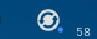
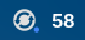
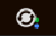
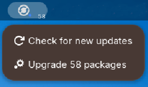
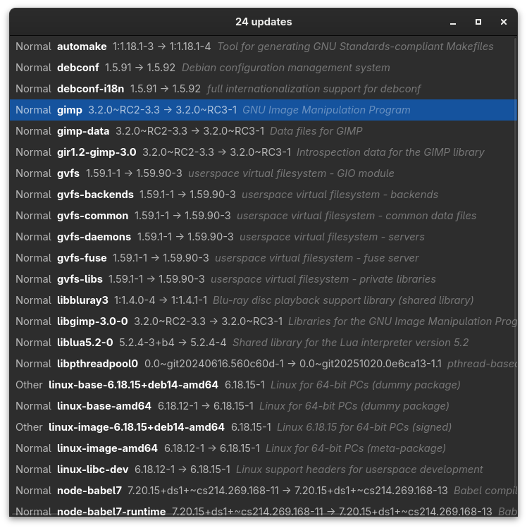
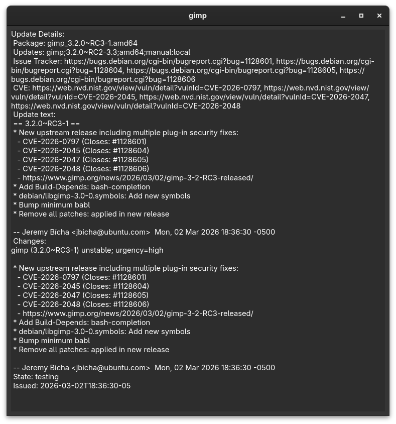
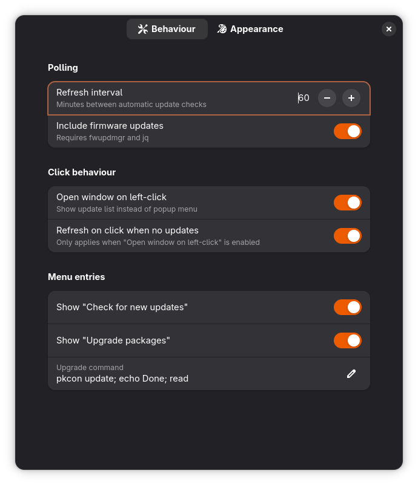
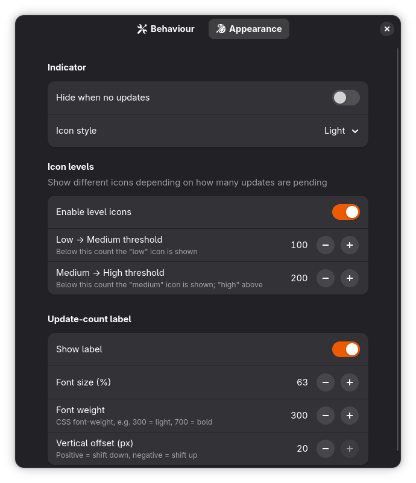

# Updates Indicator

A GNOME Shell extension that monitors pending system updates via PackageKit D-Bus and displays a panel indicator with detailed update information. Features automatic update checking, firmware update support, and a comprehensive updates list window.

## Features

### Core Functionality
- **Real-time monitoring** via PackageKit D-Bus signals for instant update detection
- **Automatic update checks** with configurable polling intervals
- **Panel indicator** showing update count with customizable icons and labels
- **Updates list window** with search functionality and per-package details
- **Firmware updates** support via fwupdmgr integration (optional)

### Customization Options
- **Icon styles**: dark, light, or symbolic
- **Notification levels**: configurable thresholds for low/medium/high update counts
- **Update count label** with adjustable font size, weight, and position
- **Hide indicator** option when no updates are available
- **Custom upgrade command** for package installation

## Requirements

### Required
- PackageKit with one of the `pkgcli`/`pkgctl`/`pkcon` tool

### Optional
- `fwupdmgr` and `jq` for firmware update support
- `xdg-terminal-exec` or compatible terminal emulator for upgrade commands

## Installation

### From GitHub Release

1. Download the latest release `.zip` file from the [Releases page](https://github.com/zamszowy/gnome-updates-indicator/releases)
2. Install using GNOME Extensions tool:
   ```bash
   gnome-extensions install updates-indicator@zamszowy.shell-extension.zip
   ```
3. Enable the extension:
   ```bash
   gnome-extensions enable updates-indicator@zamszowy
   ```
4. Restart GNOME Shell:
   - **Xorg**: Press `Alt+F2`, type `r`, press Enter
   - **Wayland**: Log out and log back in

### From Source

1. Clone the repository:
   ```bash
   git clone https://github.com/zamszowy/gnome-updates-indicator.git
   cd gnome-updates-indicator
   ```

2. Copy the extension to your local extensions directory:
   ```bash
   mkdir -p ~/.local/share/gnome-shell/extensions
   cp -r updates-indicator@zamszowy ~/.local/share/gnome-shell/extensions/
   ```

3. Compile the GSettings schemas:
   ```bash
   glib-compile-schemas ~/.local/share/gnome-shell/extensions/updates-indicator@zamszowy/schemas
   ```

4. Restart GNOME Shell (see above)

5. Enable the extension:
   ```bash
   gnome-extensions enable updates-indicator@zamszowy
   ```

## Usage

### Basic Operation
- The indicator appears in the GNOME top panel when updates are available
- Left-click to open the popup menu (default) or updates window (configurable)
- Right-click always opens the popup menu
- Hover over the indicator to see a tooltip with update summary

### Updates List Window
- Search for specific packages
- Click on any package to view detailed information

### Preferences

Access preferences through the Extensions app.

## Troubleshooting

### No updates showing despite available updates
- Ensure PackageKit is running: `systemctl status packagekit`
- Check if your package manager CLI tool is installed
- View the error window from the menu for diagnostic information

### Extension not loading
- Verify GNOME Shell version compatibility
- Check extension logs: `journalctl -f -o cat /usr/bin/gnome-shell`
- Ensure schemas are compiled correctly

### Firmware updates not appearing
- Install fwupdmgr: `sudo dnf install fwupd` (Fedora) or `sudo apt install fwupd` (Debian/Ubuntu)
- Install jq: `sudo dnf install jq` or `sudo apt install jq`
- Enable firmware updates in preferences

## Screenshots

### Panel




  


### Info window




### Settings


